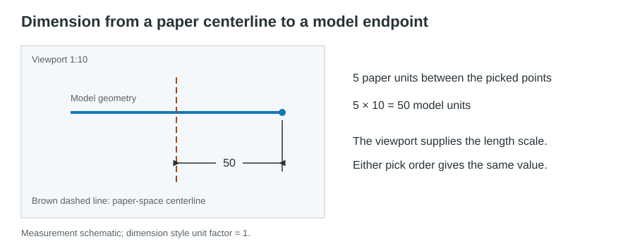

# Dimensions through layout viewports

In paper space, snap to model geometry displayed through a planar, orthographic
viewport. `DIMLINEAR`, `DIMALIGNED`, `DIMANGULAR`, `DIMRADIUS`, and `DIMDIAMETER`
also support their usual object-pick modes through these viewports.

## Measurement

- Model geometry supplies the viewport scale. A 100-unit model length displayed
  at 1:10 measures 100, although it occupies 10 paper units.
- A paper-space centerline or free sheet point can be combined with model
  geometry through one viewport, in either pick order. The paper-space span is
  measured using that viewport's scale.
- Sheet-only dimensions measure paper units, even inside a viewport rectangle.
- Model picks from a second viewport are rejected without advancing the command.
  Dimension-line and text placement do not change the measurement scale.
- The current dimension style's unit conversion is preserved. Angular dimensions
  do not use length compensation. `DIMASSOC=0` explodes the compensated dimension.

Snapping and object picking respect visibility, clipping, and viewport draw order.
Paper geometry has priority in object picks. Ordinary selection uses the active
drawing space. Object picks reuse the resident interaction index and resolve
nested block transforms.

## Saved scale

Length dimensions store paper-space definition points and a negative `DIMLFAC`
override: user unit factor multiplied by `1 / viewport scale`.
`OCS_VIEWPORT_MEASUREMENT` XData stores version `1` (integer16), the positive user
factor (real), and viewport compensation (real). Keeping the factors separate
allows compensation to change without losing the user's unit conversion.
Both the override and XData survive DXF/DWG saves and undo/redo.

Viewport dimensions are nonassociative: later source or viewport edits do not
update them. The drawing's `DIMASSOC` setting and direct model/paper associations
keep their existing behavior.

## Limits

Perspective and oblique views are unsupported. Object picks decline array
instances without an addressable instance index, nesting beyond eight levels,
and radial measurements of nonuniformly scaled circles or arcs.

## Tests

Run `cargo test --locked --lib viewport_dimension`. Tests cover the five commands,
mixed sheet/model input, styles, clipped/overlapping viewports, object picks,
input retries, exploded dimensions, undo/redo, and DXF/DWG persistence.
